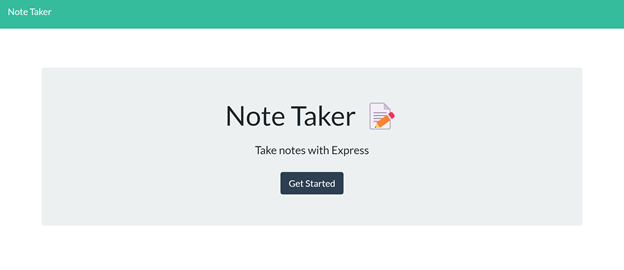
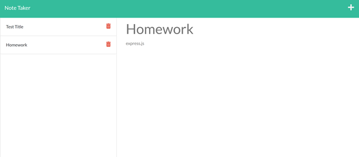

# Note-Taker

## Descrpition 
This webpage allows users to write and save notes. when the user deploys the application, they will be presented with a introduction page. When the user pressed "Get Started", they are then presented with the homepage. The user can type the note title and note text in the specific sections. They then can save the note in the upper right hand corner. The note is then placed on the left hand side of the page.

## Installation
* link to website: https://github.com/ckrum21/Note-Taker
* link to GitHub: https://github.com/ckrum21 
* link to Herou: https://dry-atoll-42601.herokuapp.com/

Install this website by cloning the code to your local devices.

software required to download this website:
* GitBash or other terminal
* Visual Studio Code

## Usage

The code used for this webpage is HTML, CSS, JavaScript, Node, and express.js.

## Credits
Chelsea Krum 